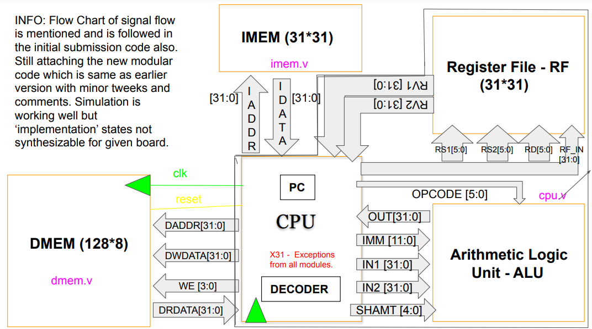

# Pipelined RISCV-Processor
 This repo contains verilog code of a **multi-stage pipelined RISC-V** processor with stalling, data-forwarding, **hazard detection**, **branch predictor**, **DMEM ECC** and **CORDIC FFT** accelerator. [Link](https://riscv.org/wp-content/uploads/2017/05/riscv-spec-v2.2.pdf) for RISCV ISA interpretation. This work was done as a part of **Computer Organization** course project under the guidance of [Prof. Nitin](https://chandrachoodan.gitlab.io/) at [IIT Madras](https://www.iitm.ac.in/). 

## RISC-V CPU
1. `Pipelined_CPU/EE17B069_ASSIGNMENT4_FINAL/ee17b114_ee17b069_assgn4/wd_assign_4/cpu_pipeline` contains HDL implementation of a 5-stage pipelined RISC-V CPU with stalling, data forwarding and hazard detection. 
2. `Single_Cycle_CPU` implements a single-cycle CPU with some assumption as stated in it's `README.md`. 
3. The whole CPU was developed in stages, starting with ALU, MEM, serial multiplier, etc. till a pipelined version.

## Branch predictor & ECC-RAM

An exta **BRANCH_PREDICTOR** hardware (`BranchPredictor_DMEMDelay/BRANCH_PREDICTION_EE17B069/Branch_prediction`) that tries to prevent stalls/roll backs because of wrong branches. 
1. The decision on whether to take or not take the branch (branch prediction) prior to the ‘verdict’ must be based on **some statistics of previous encounters** with those branch statements. 
2. Hence, we came up with a simple statistic - we save the ‘verdict’ of every branch statement by allowing it to vote for "branch not taken" times or "branch taken" times. 
3. We use this statistic while we branch predict - if the votes for "branch taken" time is more than the "branch not taken" times , instead of loading PC+4, we load the branched PC and vice versa. This we help us treat every branch statement individually based on their statistics.

A **DMEM_DELAY** model (`BranchPredictor_DMEMDelay/DMEM_DELAY_EE17B069/dmem_delay`) creates different explicit delays for different memory blocks (Cache vs DMEM) to simulate real life scenario. If a block in DMEM errors out, it creates a mapping of that erroneous space to another redundant memory space, thereby enabling ECC memories.

Both of them were simulated for critical instruction sets and hardware implementation for the same worked as expected.

## CORDIC FFT accelerator
1. `CORDIC_FFT_accelerator/main_cordic_fft.v` implementats a **16-point Discrete Fourier transform** using the Fast Fourier Transform (radix-2, radix-4) algorithm and
the **CORDIC** algorithm (for memory efficiency), with 16 bit precision. 
2. Simulations were performed in Xilinx ISE, Vivado. Results show that the relative mean square error in the implementation with respect to corresponding FFT computations in MATLAB are less than **3%**. 
3. Find [paper](./CORDIC_FFT_accelerator/cordic_fft_info.pdf).

After the entire project was coded in assembly, it was verified by emulating on a **Spartan-6 FPGA** to control external IOs like motors/LCDs, run complex FFT algorithms to measure speed-ups due to the FFT accelerator, etc.
